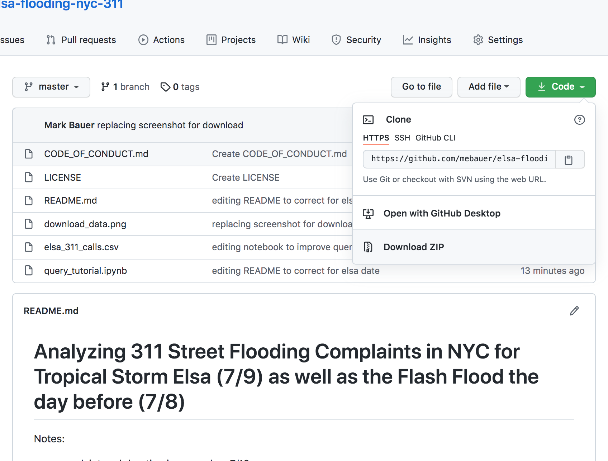

# Analyzing 311 Street Flooding Complaints in NYC for Tropical Storm Elsa (7/9) as well as the Flash Flood the day before (7/8)

Notes:  
- complaint end duration is capped on 7/12  
- full complaint duration is from 7/8 to 7/12  
- query only includes **descriptor = Street Flooding (SJ)**

author: Mark Bauer  
created date: 07.12.21 

how to download the data:  
- click the green **Code** Button  
- click **Download ZIP**  
- check your Downloads folder

screenshot below:

link to 311 data on nyc open data: https://data.cityofnewyork.us/Social-Services/311-Service-Requests-from-2010-to-Present/erm2-nwe9 

